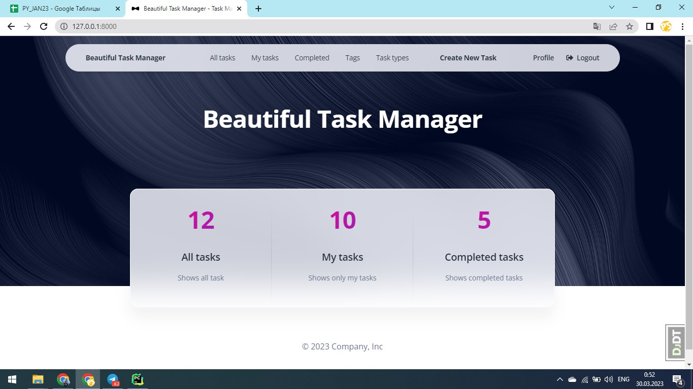
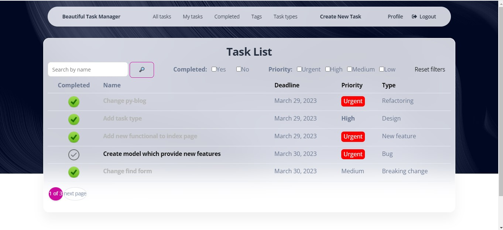

# Beautiful Task Manager

Django project for managing your tasks

## Check it out!
[Task Manager Project deployed to Render](https://task-manager-hhdl.onrender.com/)

## Installation

```shell
git clone https://github.com/SafonovVladimir/it-company-task-manager.git
cd it-company-task-manager
python -m venv venv
venv\Scripts\activate (on Windows)
source venv/bin/activate (on macOS)
pip install -r requirements.txt
python manage.py runserver #Starts Django Server
```

## Features

* Authentication functionality for Worker/User
* Managing tasks, task's type, tags directly from our website
* Sort by Deadline and Priority in ascending and descending order.
* Powerful admin panel for advanced managing

## Credential for testing
* login: user
* password: user12345

## Demo
* Main page


* Task List


* Sort by Priority (asc and desc)
.jpg)

* Sort by Deadline (asc and desc)
.jpg)